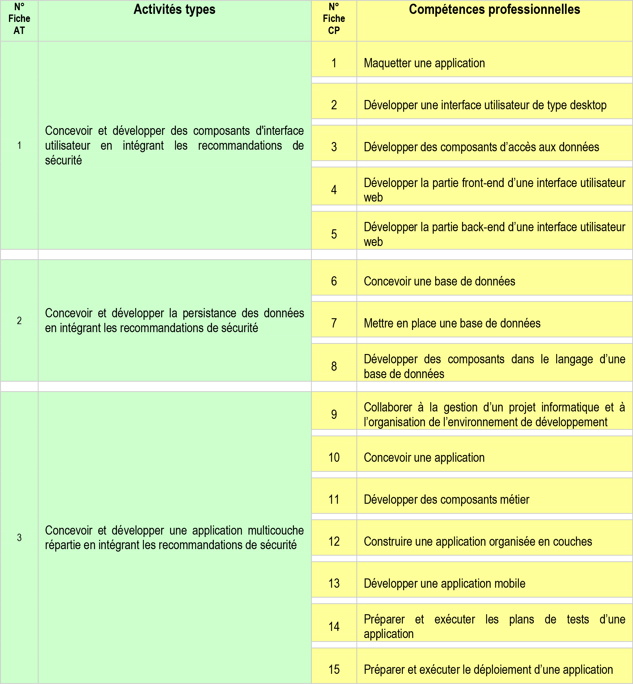

# Dossier Projet CDA
Ce dossier de projet vise à démontrer la maîtrise des compétences nécessaires pour l'obtention du titre de Concepteur et Développeur d'Applications (CDA). Il présente un projet complet dans lequel j'ai appliqué mes connaissances et compétences en développement logiciel, illustrant ainsi ma capacité à concevoir et développer des applications de manière professionnelle.

## Table des matières

1. [Compétences du référentiel](#competences-details)
2. [Résumé du Projet (en Anglais)](docs/resume/resume.md)
3. [Gestion de Projet](docs/gestion-de-projet/gestion-de-projet.md)
4. [Cahier des charges](docs/cahier-des-charges/cahier-des-charges.md)
5. [Spécifications Fonctionnelles](docs/specifications-fonctionnelles/specifications-fonctionnelles.md)
6. [Spécifications Techniques](docs/specifications-techniques/specifications-techniques.md)
7. [Réalisations](docs/realisations/realisations.md)
8. [Veille Technologique et Sécurité](docs/veille-technologique-et-securite/veille-technologique-et-securite.md)
9. [Situation de Travail et Recherche](docs/situation-de-travail-et-recherche/situation-de-travail-et-recherche.md)
10. [Et si c'était à refaire ?](docs/retrospective/rétrospective.md)

## Compétences du Référentiel

Liste des compétences du référentiel du titre **Concepteur développeur d’applications** couvertes par le projet :

  
Voir les compétences

  

